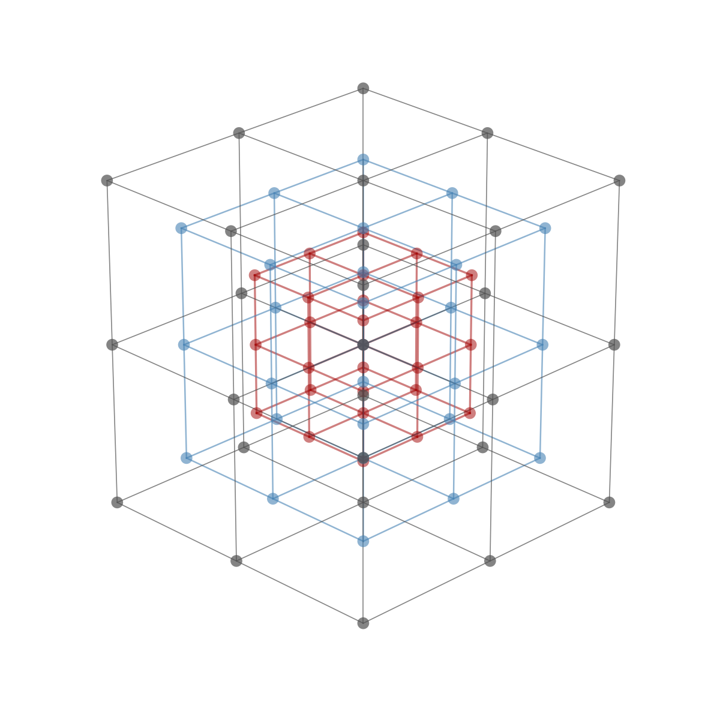

# Combinatorial Experiment Design

[](https://github.com/liangyuchen-research/combinatorial-experiment-design/actions/workflows/checks.yml)

Python utilities for studying structured experimental grids and measurement sequences. The examples calculate grid rank sizes and construct a compact set of ordered paths that covers every subset of six experimental factors.

## Tools

| Script | Method | Default example |
| --- | --- | --- |
| `src/product_lattice_width.py` | Polynomial convolution for product-lattice rank counts | Six dimensions with five values per dimension |
| `src/boolean_subset_paths.py` | Symmetric chain decomposition of a Boolean lattice | 20 paths covering all 64 subsets of six elements |
| `src/nested_lattices.py` | Three-dimensional grid visualization | Three nested grids with side lengths 3, 5, and 7 |

<p align="center"></p>

*Three nested cubic grids (side lengths 3, 5 and 7) drawn by `src/nested_lattices.py --output docs/figures/nested_lattices.png`.*

A rank groups grid points with the same coordinate sum. Each permutation path adds one factor at a time, so its prefixes form a sequence of nested experimental subsets. The 20-path construction meets the middle-rank lower bound for the six-element example.

## Run

Use Python 3.10 or newer. The rank and subset calculations require only the standard library:

```bash
python src/product_lattice_width.py
python src/boolean_subset_paths.py
```

Install NumPy and Matplotlib for the grid visualization:

```bash
python -m pip install -r requirements.txt
python src/nested_lattices.py
```

## Validation

```bash
python -m unittest discover -s tests -v
```

Tests verify that rank counts sum to the grid cardinality and are symmetric, each path is a valid permutation, and the path prefixes cover every subset. They also check the number of paths against the middle-rank lower bound.

These are exploratory utilities for experimental design. They do not model instrument travel, acquisition time, or hardware constraints. The chain decomposition is a standard combinatorial construction.

## Attribution

The scripts retain the algorithms and numerical defaults of the original research utilities. See [NOTICE.md](NOTICE.md) for attribution.
